# ⚽ FIFA World Cup Golden Boot Dashboard on AWS

A production-style DevOps project demonstrating the deployment of a React application on AWS with high availability, automatic scaling, load balancing, a custom domain, and HTTPS.

---

## 📖 Project Overview

This project showcases a FIFA World Cup Golden Boot Dashboard built using **React** and **Vite**, then deployed on **Amazon Web Services (AWS)** using production-oriented infrastructure.

The application was first deployed on an **Amazon EC2** instance running **Nginx**. A **Custom Amazon Machine Image (AMI)** was created from the configured server and used to build a **Launch Template**. An **Auto Scaling Group (ASG)** was then configured to automatically launch or terminate EC2 instances based on **Average CPU Utilization**.

Incoming traffic is distributed using an **Application Load Balancer (ALB)**, while **Amazon Route 53** maps a custom domain to the load balancer. HTTPS is enabled using **AWS Certificate Manager (ACM)**.

---

# ✨ Features

## Application

- FIFA-themed responsive UI
- Top 10 Adidas Golden Boot leaderboard
- Player images and country flags
- Featured hero card for the top-ranked player
- Modern card-based design

## AWS Infrastructure

- Amazon EC2 deployment
- Nginx production web server
- Custom Amazon Machine Image (AMI)
- Launch Template
- Auto Scaling Group
- Application Load Balancer
- Target Group
- Amazon Route 53
- HTTPS using AWS Certificate Manager
- CloudWatch monitoring
- CPU-based Auto Scaling

---

# 🏗 Architecture

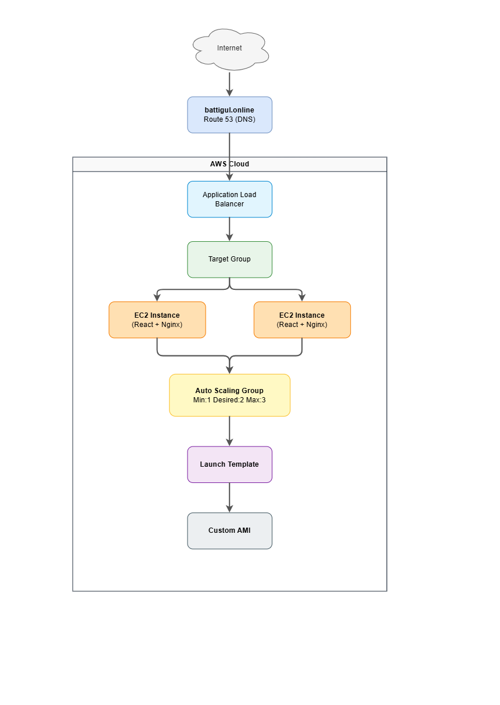

---

# ☁ AWS Services Used

- Amazon EC2
- Amazon Machine Image (AMI)
- Launch Templates
- Auto Scaling Groups
- Application Load Balancer
- Target Groups
- Amazon Route 53
- AWS Certificate Manager (ACM)
- Amazon CloudWatch

---

# 🛠 Tech Stack

## Frontend

- React
- Vite
- CSS

## Web Server

- Nginx

## AWS

- Amazon EC2
- AMI
- Launch Templates
- Auto Scaling Groups
- Application Load Balancer
- Target Groups
- Route 53
- ACM
- CloudWatch

## Testing

- ApacheBench (ab)
- stress

---

# 🚀 Deployment Workflow

1. Developed the React application locally using React and Vite.
2. Built the production bundle using:

```bash
npm run build
```

3. Installed and configured Nginx on an Amazon EC2 instance.
4. Deployed the React production build.
5. Created a Custom AMI from the configured EC2 instance.
6. Created a Launch Template using the AMI.
7. Created an Auto Scaling Group.
8. Attached the Auto Scaling Group to an Application Load Balancer.
9. Configured Target Tracking scaling based on Average CPU Utilization.
10. Connected a custom domain using Amazon Route 53.
11. Enabled HTTPS using AWS Certificate Manager.

---

# 📷 Application

## Homepage


---

# ⚙ AWS Infrastructure

## Custom AMI

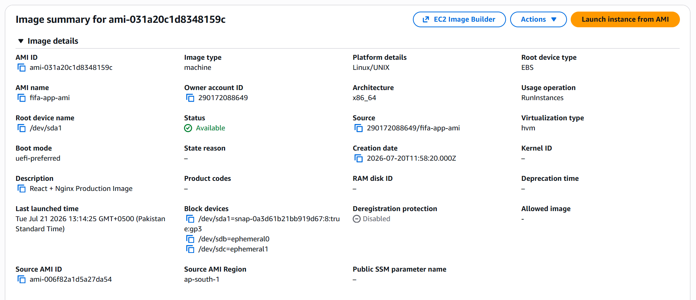

---

## Launch Template

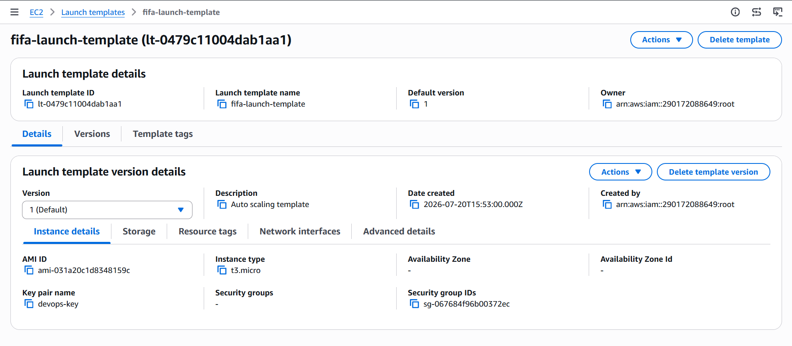

---

## Auto Scaling Group

Configuration:

- **Minimum Capacity:** 1
- **Desired Capacity:** 2
- **Maximum Capacity:** 3

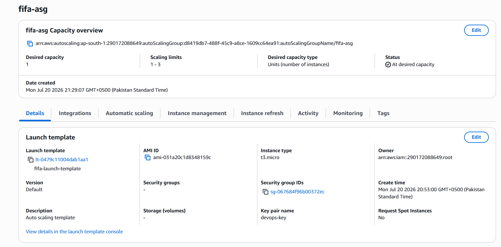

---

## Target Tracking Scaling Policy

The Auto Scaling Group uses a **Target Tracking Scaling Policy** based on **Average CPU Utilization**.

Configuration:

- Metric: **Average CPU Utilization**
- Target CPU Utilization: **20%**

When the average CPU utilization exceeded the configured threshold, the Auto Scaling Group automatically launched an additional EC2 instance. When CPU utilization returned to normal, unnecessary instances were terminated automatically.

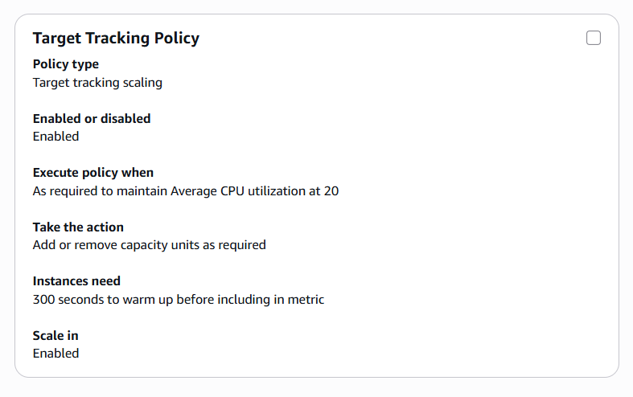

---

## Application Load Balancer

The Application Load Balancer distributes incoming requests across all healthy EC2 instances registered in the Target Group.

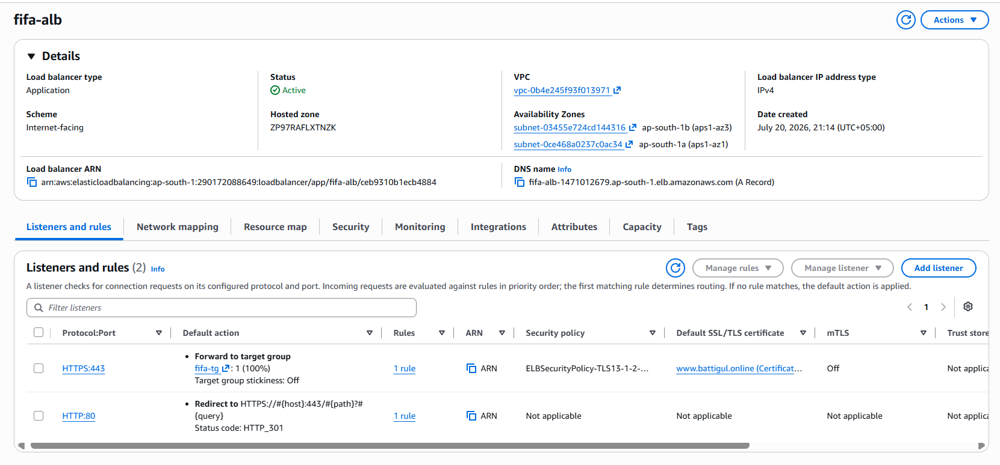

---

## Target Group

The Target Group continuously performs health checks and routes traffic only to healthy EC2 instances.

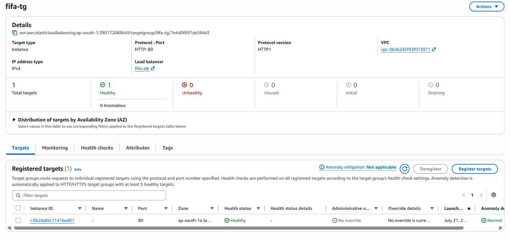

---

# 📈 Auto Scaling Demonstration

The Auto Scaling Group was configured with:

- **Minimum Capacity:** 1
- **Desired Capacity:** 2
- **Maximum Capacity:** 3

To demonstrate automatic scaling, both HTTP traffic and CPU load were generated.

## HTTP Load Testing

ApacheBench was used to generate concurrent HTTP requests through the Application Load Balancer.

```bash
ab -n 50000 -c 300 http://<ALB-DNS>
```

This simulated hundreds of concurrent users accessing the application.

---

## CPU Stress Testing

To increase CPU utilization above the configured threshold, the following command was executed on an EC2 instance:

```bash
stress --cpu 2 --timeout 600
```

This generated sustained CPU load, allowing the **Average CPU Utilization** of the Auto Scaling Group to exceed the configured target.

CloudWatch monitored the CPU metrics throughout the test.

---

# 📊 CloudWatch CPU Utilization

The graphs below show CPU utilization before, during, and after the stress test.

During testing:

- CPU utilization increased significantly.
- Average CPU utilization exceeded the configured target.
- The Auto Scaling Group automatically launched a third EC2 instance.
- After the workload ended, CPU utilization gradually decreased.
- The Auto Scaling Group automatically scaled the environment back down, eventually leaving a single running EC2 instance.

### CPU Utilization Graphs

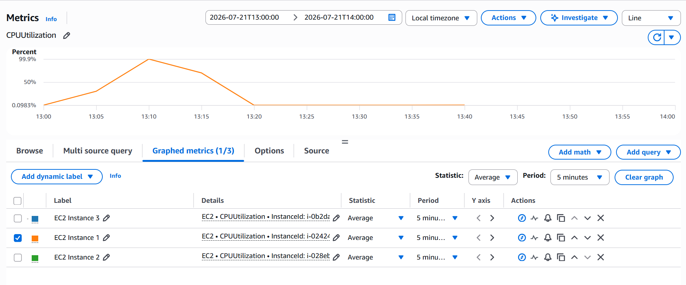

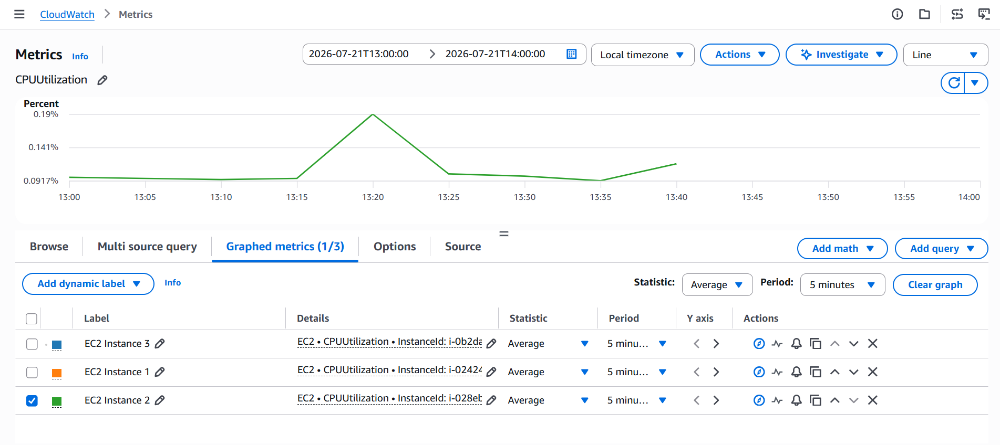

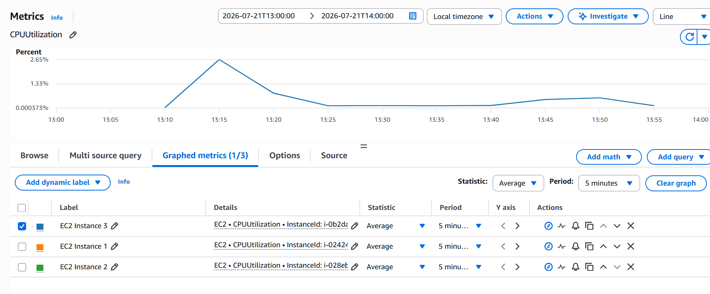

---

# 🔄 Auto Scaling Activity

The Auto Scaling activity log shows the complete scaling lifecycle.

Initially, the Auto Scaling Group maintained **2 running EC2 instances** (desired capacity).

After CPU utilization exceeded the configured threshold:

- A third EC2 instance was launched automatically.
- The new instance passed health checks.
- The Application Load Balancer registered the instance and began routing traffic to it.

Once the stress test ended and CPU utilization returned to normal:

- The Auto Scaling Group automatically terminated the additional instances.
- The infrastructure eventually scaled back down to **1 running EC2 instance**, demonstrating automatic scale-in based on reduced demand.

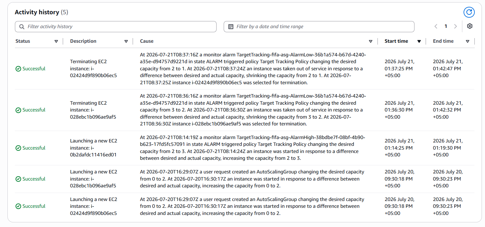

---

# 📚 What I Learned

Through this project, I gained practical experience with:

- Deploying React applications on Amazon EC2
- Configuring Nginx as a production web server
- Building production-ready React applications using Vite
- Creating reusable Amazon Machine Images (AMIs)
- Creating and managing Launch Templates
- Configuring Auto Scaling Groups
- Implementing Target Tracking scaling policies
- Configuring Application Load Balancers
- Using Target Groups and health checks
- Managing DNS with Amazon Route 53
- Securing applications with AWS Certificate Manager
- Monitoring infrastructure using Amazon CloudWatch
- Load testing using ApacheBench
- CPU stress testing using the Linux `stress` utility
- Designing highly available and scalable AWS infrastructure

---

# 👨‍💻 Author

**Malahim Chaudhary**

- Computer Science Student — FAST-NUCES
- DevOps Intern — NETSOL Technologies

---

## ⭐ If you found this project interesting, feel free to star the repository!
